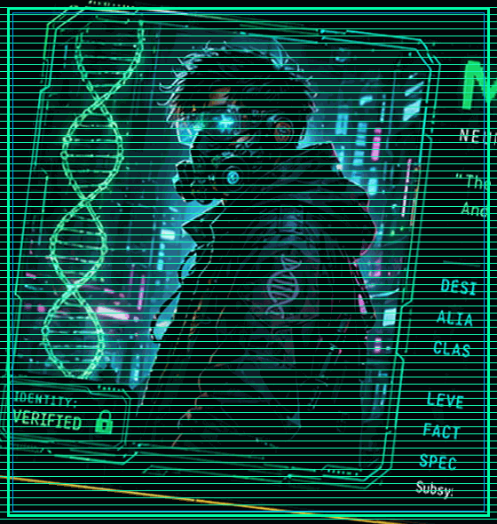
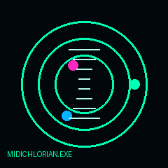

<div align="center">

# `MIDICHLORIAN.EXE`

### `NEURAL BIOLOGICAL INTELLIGENCE ENTITY // LEVEL 01 // PH.D HUNTER`



<br>

[](#-main-quest)
[](#-character-build)
[](#-boss-battle-phd-applications)

> **SYSTEM MESSAGE:** A lone molecular biologist wandered into the computational realm.  
> **RESULT:** Python was stronger than expected.  
> **CURRENT OBJECTIVE:** Acquire the legendary artifact known as **ONE PhD**.

</div>

---

## `// BOOT SEQUENCE`

<details open>
<summary><b>▶ OPEN NEURAL INTERFACE</b></summary>

```text
╔══════════════════════════════════════════════════════════════╗
║                 MIDICHLORIAN.EXE // BOOT LOG                 ║
╠══════════════════════════════════════════════════════════════╣
║ [OK] Biological core ................. ONLINE                ║
║ [OK] Molecular subsystem ............ ONLINE                ║
║ [OK] Research engine ................ ONLINE                ║
║ [OK] Bioinformatics module .......... LOADING               ║
║ [!!] Python proficiency ............. GRINDING XP            ║
║ [!!] Coffee reserves ............... CRITICAL               ║
║ [!!] Creativity attribute .......... OVERFLOW               ║
║                                                              ║
║ CLASS: MOLECULAR BIOLOGIST / BIOINFORMATICIAN                ║
║ LEVEL: 01                                                    ║
║ ALIGNMENT: SCIENCE                                           ║
║ PRIMARY DIRECTIVE: INNOVATE NEW HORIZONS IN SCIENCE          ║
║                                                              ║
║ LEGENDARY LOOT TARGET: ONE PhD                               ║
╚══════════════════════════════════════════════════════════════╝
```

</details>

---

## `// CHARACTER BUILD`

**Designation:** `Joel The Scholar`  
**Character Identity:** `MIDICHLORIAN.EXE`  
**Build:** `Molecular Biologist + Bioinformatician`  
**Level:** `01 — PhD Hunter`  
**Playstyle:** `Research / Code / Experiment / Break Things / Fix Them / Repeat`

### 🧬 Attribute Matrix

| ATTRIBUTE | POWER | SYSTEM NOTE |
|---|---:|---|
| 🧬 Molecular Biology | `45/100` | Biological core online |
| 🧪 Wet Lab | `69/100` | Hands-on combat specialization |
| 💻 Bioinformatics | `32/100` | Neural interface under construction |
| 🐍 Python | `21/100` | **Currently grinding XP** |
| 📊 Data Analysis | `67/100` | Statistical weapons acquired |
| 🧫 Microbiology | `48/100` | Microbial subsystem functional |
| 🔬 Research | `78/100` | Primary class attribute |
| 📝 Scientific Writing | `65/100` | Manuscript engine operational |
| 🎨 Creativity / Design | `1000/100` | **⚠ ATTRIBUTE OVERFLOW — WE STOPPED COUNTING** |
| 🧠 Problem Solving | `PROBLEM MAKER` | `SYSTEM HAS NO FURTHER COMMENTS` |



---

## `// SKILL TREE`

```text
                           ┌──────────────────────┐
                           │   🧬 THE SCHOLAR      │
                           │      LEVEL 01         │
                           └──────────┬───────────┘
                                      │
                 ┌────────────────────┴────────────────────┐
                 │                                         │
        ┌────────▼────────┐                       ┌────────▼────────┐
        │ MOLECULAR BIO   │                       │ COMPUTATIONAL   │
        │      45         │                       │      BIOLOGY    │
        └────────┬────────┘                       └────────┬────────┘
                 │                                         │
        ┌────────┼────────┐                       ┌────────┼────────┐
        │        │        │                       │        │        │
     VIROLOGY  GENE     CANCER              BIOINFO  PYTHON  DATA
               THERAPY   BIOLOGY                       │
                                                       │
                                                 [GRIND XP]
                 │                                         │
                 └──────────────────┬──────────────────────┘
                                    │
                         ⚔️ LEGENDARY SPECIALIZATION
                                    │
                             ONE PhD ACQUIRED
                                  [LOCKED]
```

### 🔭 PhD Research Constellation

`BIOINFORMATICS` · `COMPUTATIONAL BIOLOGY` · `MOLECULAR BIOLOGY` · `VIROLOGY` · `GENE THERAPY` · `CANCER BIOLOGY`

---

## `// MAIN QUEST`

### ⚔️ `INNOVATE NEW HORIZONS IN SCIENCE`

> **Mission objective:** Build enough scientific XP, computational firepower and research experience to enter the next level of the scientific galaxy.

**Primary target:** `ONE PhD`  
**Quest type:** `LEGENDARY`  
**Current stage:** `HUNTING`  
**Difficulty:** `☠☠☠☠☠`

---

## `// ACTIVE QUEST`

### 🟢 `RID DATABASE // INTEGRATION-SITE ARCHIVE`

**Status:** `ACTIVE`

> Investigating retroviral integration-site data and transforming messy biological information into structured, analyzable datasets.

**Mission modules:**

- Database extraction
- RID-format data organization
- Gene annotation
- Integration-site analysis
- Patient/sample metadata
- Data auditing
- Reproducible analysis pipelines

**XP reward:** `???`  
**Threat level:** `HIGH`  
**Quest status:** `IN PROGRESS`

---

## `// SIDE QUESTS // CODE REPOSITORIES`

### 🧮 `NUMERATOR v69`
**Type:** Calculation / Python experiment  
**Status:** `ACTIVE / EXPERIMENTAL`

### 🧮 `Calculator-App`
A simple calculator application created while learning Python.

[**→ OPEN REPOSITORY**](https://github.com/joel-jaison-codes/Calculator-App)

### 🔬 `Haemocytometer-Counter-App`
A simple application for counting cells using a haemocytometer.

[**→ OPEN REPOSITORY**](https://github.com/joel-jaison-codes/Haemocytometer-Counter-App)

### 🧬 `DNA-Sequence-Composition-Analyzer`
A sequence-analysis project for exploring nucleotide composition.

[**→ OPEN REPOSITORY**](https://github.com/joel-jaison-codes/DNA-Sequence-Composition-Analyzer)

### 🛰️ `ensemble_analyser`
An Ensembl-oriented analysis project for extracting and analyzing genomic information.

### 🧪 `BIOINFORMATICS XP GRIND`
Current mission: turn biological questions into reproducible computational workflows.

---

## `// RESEARCH ARCHIVE`

### 🦟 `Plant Extracts Against Aedes albopictus`
**Status:** `COMPLETED`

Research investigating bioactive compounds from *Ocimum tenuiflorum* as biocontrol agents against *Aedes albopictus*, including larvicidal activity and surface-tension dynamics.

**Research modules:**  
`Larvicidal Bioassay` · `LC50 / LC99` · `Tensiometry` · `Wilhelmy Plate` · `GC-MS` · `SEM`

---

### 🧬 `Vector Biology Research`
**Status:** `RESEARCH EXPERIENCE`

Laboratory research involving mosquito biology and experimental investigation of biological control strategies.

---

### 🧫 `Molecular & Microbiology Training`
**Status:** `ACQUIRED XP`

Experience across molecular biology, microbiology and laboratory workflows, including PCR-based techniques, cell-related laboratory work, antimicrobial susceptibility testing, biofilm assays and quantitative image analysis.

---

## `// EDUCATION DATABASE`

### 🎓 `INTEGRATED MSc IN LIFE SCIENCES`
**Central University of Tamil Nadu** · `Graduated 2024`

**Academic specialization:** Molecular Biology / Genomics-oriented Life Sciences

`CGPA: 8.51`

---

### 🧠 `UNDERGRADUATE FOUNDATION`
Integrated life-sciences training spanning molecular biology, microbiology, genetics, biotechnology and related biological sciences.

---

## `// ACHIEVEMENT UNLOCKS`

| ACHIEVEMENT | STATUS |
|---|---|
| 🏆 `MSc // Life Sciences` | `UNLOCKED` |
| 🎓 `GATE Qualified` | `UNLOCKED` |
| 🧬 `Molecular Biology Researcher` | `UNLOCKED` |
| 🦟 `Vector Biology Research` | `UNLOCKED` |
| 🧪 `MSc Dissertation` | `UNLOCKED` |
| 🏅 `Dissertation Presentation — Consolation Prize` | `UNLOCKED` |
| 🎤 `Conference Presentation — ICB-24 / BioVision` | `UNLOCKED` |
| 🧑‍🔬 `Research Experience` | `UNLOCKED` |
| 💻 `Bioinformatics Explorer` | `UNLOCKED` |
| 🐍 `Python Apprentice` | `IN PROGRESS` |
| 🧠 `Problem Maker` | `PERMANENT PASSIVE` |
| 🎨 `Creativity Overflow` | `SYSTEM LIMIT EXCEEDED` |
| ☕ `Late-Night Researcher` | `PASSIVE ABILITY` |
| 🎓 `Future PhD` | `LOCKED — BOSS REQUIRED` |

---

## `// LOADOUT`

### 🧪 Biological Weapons

`PCR` · `PBMC Isolation` · `MNC Isolation` · `Cell Culture` · `Antimicrobial Susceptibility Testing` · `Biofilm Assays` · `Spectrophotometry` · `Tensiometry` · `SEM` · `GC-MS`

### 💻 Computational Weapons

`Python` · `Biopython` · `Pandas` · `NumPy` · `Matplotlib` · `Jupyter` · `Linux` · `Git` · `GitHub` · `UCSC Genome Browser` · `GTEx` · `ImageJ/Fiji` · `SPSS` · `Jamovi` · `SnapGene`

### 🧬 Current XP Targets

`Python ↑` · `Bioinformatics ↑` · `Computational Biology ↑` · `Reproducible Research ↑`

---

## `// BOSS BATTLE`

# ☠️ `PH.D APPLICATIONS`

```text
╔════════════════════════════════════════════════════════════╗
║                    ⚠ BOSS ENCOUNTER                       ║
╠════════════════════════════════════════════════════════════╣
║ BOSS:              ACADEMIC GATEKEEPER                     ║
║ CLASS:             LEGENDARY                               ║
║ HP:                 ████████████████████ 100%              ║
║ ARMOR:              APPLICATION FORMS                      ║
║ SPECIAL ATTACK:     "WE REGRET TO INFORM YOU..."           ║
║ SECONDARY ATTACK:  "EXPERIENCE REQUIRED"                  ║
║                                                              ║
║ KNOWN WEAKNESS:                                            ║
║ ████████████████████████████████████████████████████████   ║
║                        PERSISTENCE                          ║
╚════════════════════════════════════════════════════════════╝
```

**Battle strategy:**  
`Apply → Research → Improve → Apply Again → Level Up → Repeat`

**Victory condition:** `ONE PhD`

---

## `// CHARACTER LORE`

> A lone molecular biologist grew up in a small village called **Central University of Tamil Nadu**.
>
> He wandered into the realm of bioinformatics and discovered that **Python was stronger than expected**.
>
> Currently gathering XP through research, coding, and questionable amounts of coffee while hunting for the legendary treasure named **One PhD**.
>
> Somewhere between the wet lab and the terminal, a new class was born:
>
> **MIDICHLORIAN.EXE — MOLECULAR BIOLOGIST // BIOINFORMATICIAN**

---

## `// SYSTEM PHILOSOPHY`

```text
┌────────────────────────────────────────────────────────────┐
│                                                            │
│  "THE LAB GIVES YOU DATA.                                 │
│   THE TERMINAL GIVES YOU POWER.                           │
│   SCIENCE GIVES YOU QUESTIONS."                           │
│                                                            │
│                    — MIDICHLORIAN.EXE                     │
│                                                            │
└────────────────────────────────────────────────────────────┘
```

---

## `// TRANSMISSION CHANNELS`

**🔗 LinkedIn**  
[linkedin.com/in/joeljaison2025](https://www.linkedin.com/in/joeljaison2025)

**🐙 GitHub**  
[github.com/joel-jaison-codes](https://github.com/joel-jaison-codes)

---

## `// INTERFACE CONTROLS`

<details>
<summary>🧬 <b>Research Protocols</b></summary>

Explore the research archive above to inspect completed missions and current scientific objectives.

</details>

<details>
<summary>💻 <b>Code Repository Matrix</b></summary>

Use the repository links above to enter individual project environments.

</details>

<details>
<summary>🎓 <b>Academic Mission</b></summary>

The ultimate objective is a PhD at the intersection of biological science and computational discovery.

</details>

<details>
<summary>🐍 <b>Python XP Log</b></summary>

`LEVEL 12/100`

`STATUS: GRINDING`

`NEXT UNLOCK: MORE AUTOMATION`

`CURRENT BUG: PROBABLY USER ERROR`

</details>

---

<div align="center">

### `SYSTEM STATUS`

`🧬 BIOLOGICAL CORE: ONLINE`  
`💻 COMPUTATIONAL CORE: BUILDING`  
`🐍 PYTHON CORE: GRINDING XP`  
`☕ COFFEE CORE: CRITICAL`  
`🎨 CREATIVITY: OVERFLOW`  
`🎓 PhD: NOT FOUND`

<br>

### ⚔️ `QUEST CONTINUES...`

**[ ONE PhD ]**

<br>

<sub>Built from molecules, algorithms, questionable coffee decisions and an unreasonable amount of curiosity.</sub>

</div>
